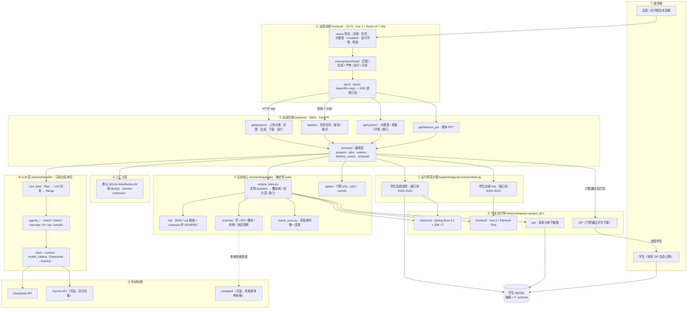
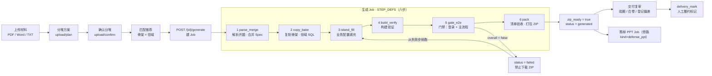
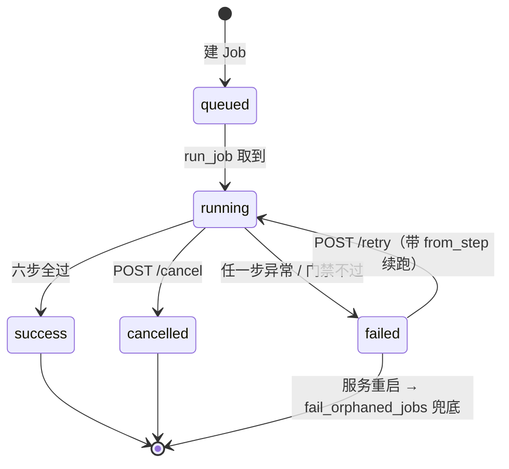
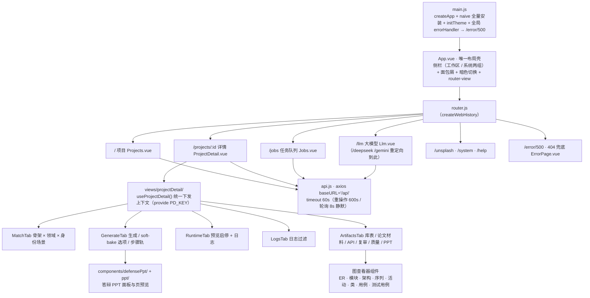
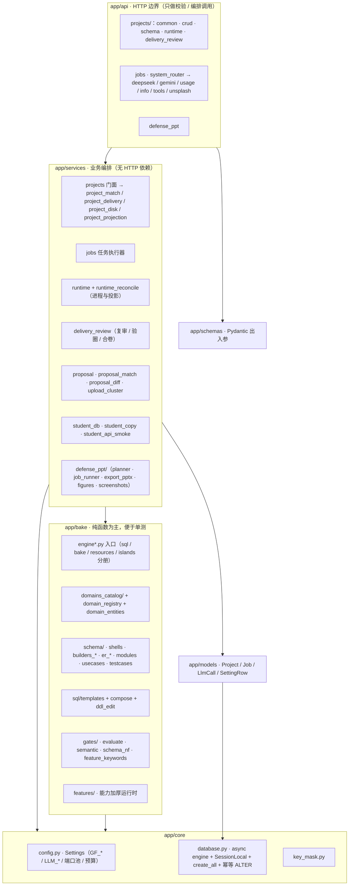
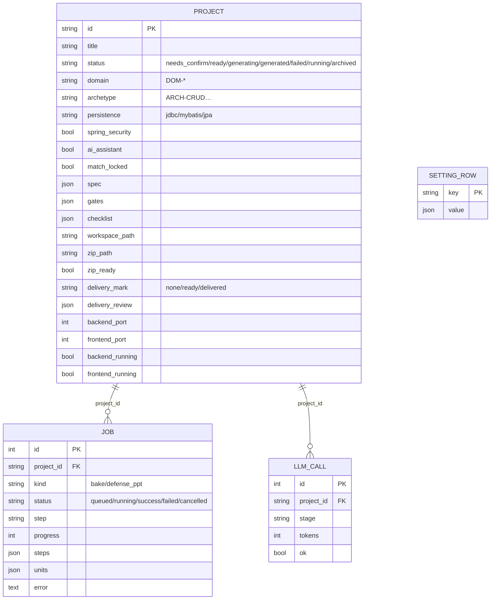
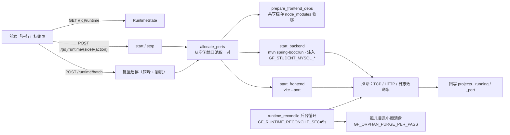
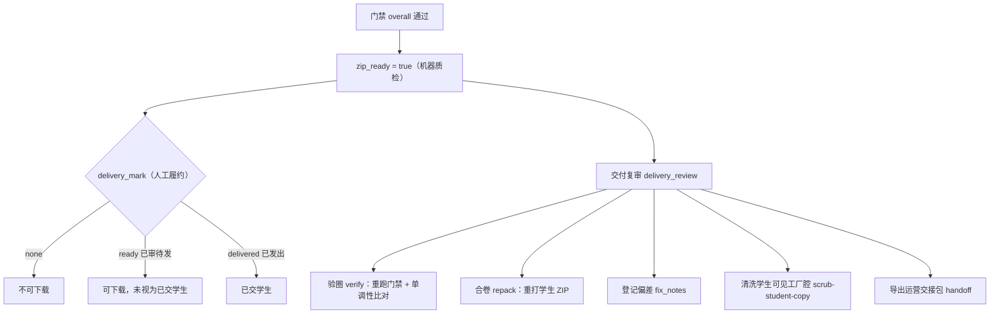
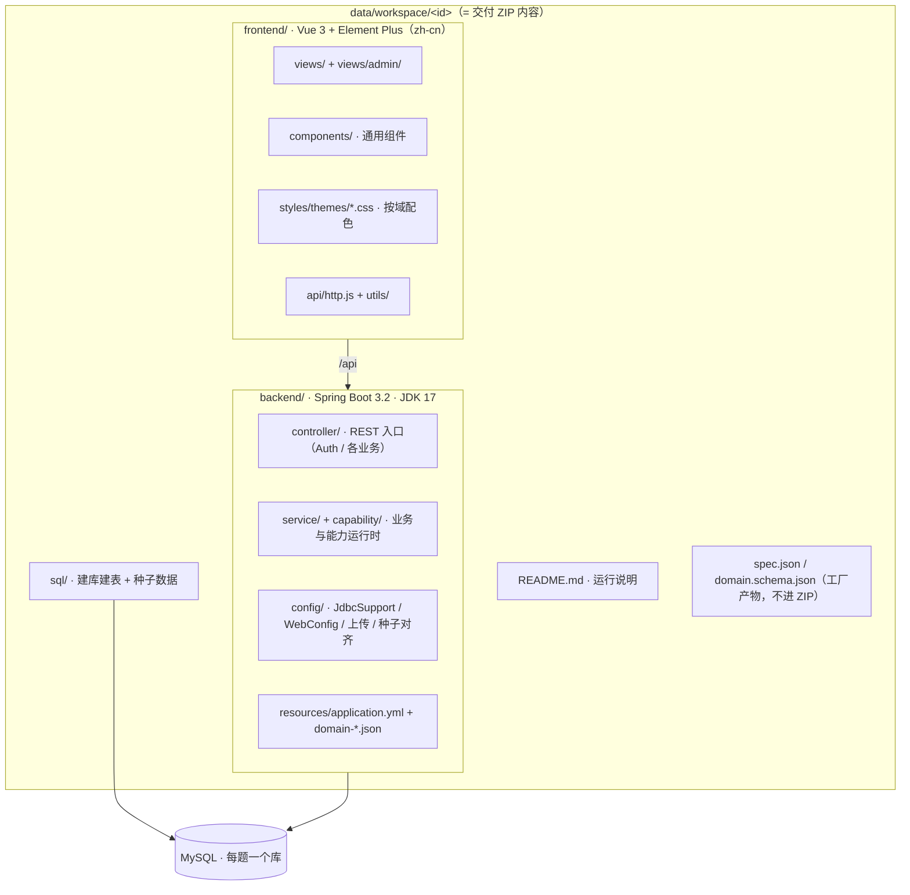
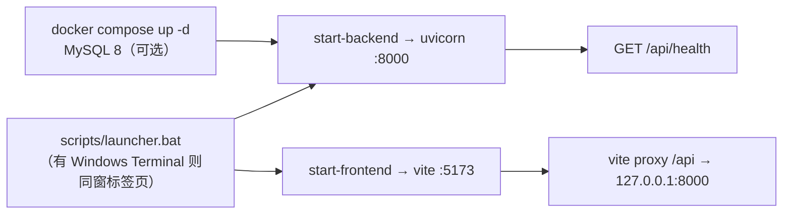

# 毕设港 · 系统架构图

> **本文只负责**：用图讲清系统怎么分层、一次「上传 → 交付」在哪些进程之间跑。
> 产品是什么 / 怎么跑 → [README.md](./README.md) · 专题索引 → [docs/README.md](./docs/README.md) · 新对话交接 → [HANDOFF.md](./HANDOFF.md)

一句话概括：**一个运营中台（FastAPI + Vue 3）驱动一条确定性流水线，把开题材料烘成可答辩的学生工程（Spring Boot 3.2 + Vue 3 + MySQL），门禁不过就不放行 ZIP。**

- 可靠性来自**固定骨架 + 模板 + 门禁**；LLM 只填白名单「业务岛」，不写业务 Java / Vue。
- 两个数据库完全分离：**工厂元库**（项目/任务/用量，默认 SQLite）与**学生库**（每题一个 MySQL schema）。
- 三种不同性质的东西都叫「图」，别混：本文件是**工厂自身**的架构；学生对内交付物里另有**论文用** E-R / 类图 / 用例图（由 `app/bake/schema/` 生成）；`prototype/` 是运营端静态原型。

---

## 1. 总体架构（运行边界）



**读图要点**

| 边界 | 说明 |
|---|---|
| 进程隔离 | 运营后端（Python）与学生工程（JVM + Node）是**两类进程**；工厂只负责启停与探活，不把学生代码跑在自身事件循环里 |
| 端口池 | 学生后端 `9100–9120`、前端 `9200–9220`；`GF_PREVIEW_MAX_RUNNING` 限制**同时运行**数，不限制选题库存 |
| 数据分离 | 工厂元库管运营状态；学生库由 `services/student_db.py` 建库建表灌种子，删项目时按规则回收 |
| LLM 边界 | LLM 只产出白名单 island / 标签 / 用例等 **schema JSON**；业务 Java / Vue 由骨架与模板决定 |

---

## 2. 一次生成 Job 的六步流水线

`services/jobs.py` 的 `STEP_DEFS` 是唯一真源；`run_job()` 在单进程 asyncio 里串行推进，每步把状态写回 `jobs.steps` 供前端渲染步骤条。



**每步实际在做什么**

| 步 | 关键实现 | 产物 / 副作用 |
|---|---|---|
| 1 `parse_merge` | `services/proposal.py`、`proposal_diff.py` | 合并后的开题文本、`spec` 契约 |
| 2 `copy_bake` | `bake/engine_bake.py` → 复制 `skeletons/baseline`，叠加 `skeletons/overlays/*`（mybatis / jpa / spring-security）与域 SQL | `data/workspace/<id>/` 完整工程骨架；`student_db.ensure_student_schema` 建库建表 |
| 3 `island_fill` | `llm/unit_flow/`：`build_delivery_plan` → 并发跑 Unit → `merge` 写回 workspace | 白名单岛文案、角色、E-R / 模块 / 用例标签；`fill_event_hub` 推 SSE |
| 4 `build_verify` | `llm/agents_fix.py` 的 `run_fix_agent` | 构建与修复轮次（`fix_rounds_max`） |
| 5 `gate_e2e` | `bake/gates/evaluate.py` 的 `evaluate_domain_gates` + `delivery_review.evaluate_workspace_gates` + QA Agent | `projects.gates`、`projects.checklist`；`overall` 决定能否打包 |
| 6 `pack` | `delivery_review.finalize_pack` → `jobs.pack_zip` | 临时文件写完再原子替换的 ZIP；排除 `node_modules` / `target` / `.git` / `islands` / `.factory` |

**门禁键（交付闸）**：`p0a` 后端骨架、`p0b` 前端骨架、`p1` 登录基线、`p2` 领域主流程 E2E、`p3a` 清单实装、`p3b` Spec/契约一致、`p3t` 技术栈、`p3d` 文档、`p3s` 语义、`p3n` 库表、`p3q` 质量摘要；外加可接题边界 `accept`。单调性键见 `bake/gates/keys.py`，复审期间由 `forbid_full_rebake` 拦截整段重跑。

---

## 3. 任务状态机



- 进度：`progress = (已完成步 + 当前步 0.5) / 6 × 100`，每步 `set_step` 即 `commit`，前端短轮询 + SSE 双通道读。
- 重启兜底：`fail_orphaned_jobs()` 把库里仍 `running/queued` 但内存无 Task 的任务标失败，避免进度条永远卡住（如停在 `pack=91%`）。
- 旁路：`kind=defense_ppt` 的 Job 走 `services/defense_ppt/job_runner.py` 自己的 5 步（证据 → 填页 Unit → 采图 → 瞎写/结构检查 → 写 `deck.json`），**不得**改动 `project.status` / `zip_ready`。

---

## 4. 运营前端结构（`frontend/src/`）



**前端约定（读代码可确认）**

| 维度 | 事实 |
|---|---|
| 技术栈 | Vue `^3.5.39` + vue-router `^4.6.4` + Naive UI `^2.44.1` + axios `^1.18.1` + jszip；Vite `^5.4.11` |
| **没有**的东西 | 无 Pinia / Vuex、无 TypeScript、无 ESLint 配置、无 `playwright.config.*`（装了没接线） |
| 状态管理 | 不用 store：`ProjectDetail.vue` 是薄壳，全部逻辑在 `views/projectDetail/useProjectDetail.js`，用 `provide(PD_KEY, …)` + `bindPd()` 下发给各标签页；各 Tab 不直接调 `api.*` |
| 壳的职责 | `App.vue` 同时是布局与导航（无单独 layout 组件）：侧栏「项目 / 任务队列 / 帮助文档」+「大模型 / Unsplash / 运行环境」，面包屑由 `route.meta.crumb` 推导 |
| 错误处理 | axios 响应拦截器统一 `message.error`；`silent: true` 用于轮询不刷屏；未捕获异常经 `app.config.errorHandler` 跳 `/error/500` |

**实时性机制（两条通道，都不是 WebSocket）**

| 场景 | 机制 | 参数 |
|---|---|---|
| 任务队列页 | 定时轮询 `GET /jobs` | `setInterval` 3000 ms |
| 生成中的项目详情 | 轮询（`lite` 模式）+ SSE | 轮询 1500 ms（`pollInFlight` 防重入，连续 2 次失败提示「状态同步暂时中断」）；SSE `GET /api/projects/{id}/fill-events`，由进程内 `fill_event_hub` 推送 unit_started / unit_done / fill_complete / fill_failed，收到 `done|failed` 自动关闭 |
| 答辩 PPT 进度 | SSE + 轮询双保险 | SSE `GET /api/projects/{id}/defense-ppt/events`（独立 channel），同时 `setInterval(pollPptJob, 800)` |
| 预览启停 | 有限次轮询收敛 | 动作后 700 ms 轮询一次；`stop` 上限 8 s、`start/restart` 上限 90 s |
| 孤儿盘清理 | 轮询状态接口 | `GET /projects/purge-orphan-disk`，1200 ms 一轮、15 分钟上限 |

> 全程无 WebSocket、无 `fetch()`：进度靠轮询 + SSE，文件类（ZIP / 交接包 / PPTX / SVG / Markdown）走浏览器直达 URL，不走 axios。

**上传链路（前端）**：`uploadMaterials.js` 负责递归收集（拖拽用 `webkitGetAsEntry()`、`.zip` 用 jszip 动态展开、跳过 `__MACOSX` / `.DS_Store` / `~$`、大小写无关去重），**超过 8 份直接报错而不是截断**；`Projects.vue` 用客户端队列逐个上传 → `upload/plan` 出分堆方案 → 人工确认 → `upload/confirm` 建项目，未确认方案刷新后可从 `upload/plans` 恢复。

**开发期代理**：`frontend/vite.config.js` 把 `/api`、`/docs`、`/redoc`、`/openapi.json` 代理到 `VITE_API_PROXY || http://127.0.0.1:8000`；host 取 `VITE_HOST || GF_HOST || 127.0.0.1`。

---

## 5. 后端分层与模块职责



**分层纪律（从代码注释可读出的约定）**

- `api/` 只做 HTTP；业务写进 `services/`；`services/projects.py` 是**门面**，正文按职责拆到 `project_match` / `project_delivery` / `project_disk` / `project_projection`，新逻辑不再往门面堆。
- `bake/` 尽量保持确定性、可单测；LLM 相关一律在 `llm/`。
- 启动生命周期（`main.py lifespan`）：`init_db()` → 回灌 DeepSeek 预算/模型设置 → `fail_orphaned_jobs()` → 启动后台对账 `start_runtime_reconcile()`，关闭时 `stop_runtime_reconcile()`。

---

## 6. 数据模型与磁盘布局



```
data/
  factory.db           工厂元库（默认 SQLite；也可指本机 MySQL）
  uploads/             上传材料落盘
  workspace/<id>/      每题学生工程工作区（backend / frontend / sql / spec.json）
  workspace/<id>.zip   门禁通过后的交付包
  logs/<id>/           job.log · backend.log · frontend.log · deepseek.log
  cache/baseline-frontend/  共享 node_modules（目录联结复用到每题，避免每题重装）

data/workspace/<id>/.factory/   工厂内部产物：bake_in_progress 锁、defense-ppt 旁路树（不进 ZIP）
skeletons/
  baseline/            学生工程骨架（jdbc 默认）
  overlays/            mybatis / jpa / spring-security 叠加层
```

---

## 7. 运行时预览子系统



**为什么这样设计**（见 `docs/preview-capacity-and-batch-ops.md`、`docs/background-reconcile-cost.md`）：学生预览一个实例就是一组 JVM + Node 进程，内存是硬约束，所以上了三重闸门：

1. **只读库**：列表 GET 与 `/stats` 不扫盘、不探活；真实运行态由后台 `runtime_reconcile` 每 `GF_RUNTIME_RECONCILE_SEC` 对账回写（投影输入签名 + 20s TTL + 每轮扫描额度，避免对账本身变贵）。
2. **内存闸门**：批量启动的额度 = `GF_PREVIEW_MAX_RUNNING − 实际在跑`，再被 `可用内存 ÷ 约 1.1 GB` 夹一次；超出额度的项返回 `deferred` 而不是硬起。
3. **错峰**：按 `GF_PREVIEW_START_STAGGER_SEC` 间隔依次启动，避开首次 Maven 编译吃满 CPU / 磁盘。

启动的学生后端带资源上限（`-Xmx320m -XX:MaxMetaspaceSize=192m -XX:TieredStopAtLevel=1`，`MAVEN_OPTS=-Xmx192m`），`mvn` / `pom.xml` 缺失时退化为内置 Python 桩，保证预览链路可演示。进程句柄只存在内存，所以停止时按「句柄 + 端口占用者」双重证据杀进程。

---

## 8. 交付闸与人工履约



**两套「通过」刻意分开**：`zip_ready` 是机器质检结论，`delivery_mark` 是人工履约动作。复审期间 `forbid_full_rebake` 禁止整段重跑生成，只能验圈 / 合卷，防止「基线修洞后 ZIP 仍是旧工程」。

---

## 9. 学生交付物内部结构



- 骨架**不含** `node_modules` / `target` / `dist`：`bake_project` 的 `copytree(ignore=…)` 明确跳过，前端依赖由预览子系统按共享缓存挂载，Maven `target` 由编译再生。
- 持久层由 `bake/persistence.py` 决定：默认 `jdbc`（JdbcTemplate），开题点名时切 `mybatis` / `jpa`，并按需叠 `addon-spring-security`。
- 场景身份（校园 / 企业 / 社区）由 `bake/scene_scan.py` 的 `scene_for(domain, title, proposal)` 统一决定，壳文案与注册资料页必须读同一 scene——**禁止改开题迁就模板**。

---

## 10. 外部依赖与降级

| 依赖 | 用途 | 缺失 / 失败时 |
|---|---|---|
| DeepSeek API | 匹配推荐、填岛、标签、QA、Fix、样例题 | 无 Key 仍可 bake：业务岛走确定性填充 |
| Gemini API（可选） | 与 DeepSeek 并存，可双开，优先一家失败自动换 | 单开时按 `LLM_PROVIDER` / 运营台开关 |
| Unsplash | 登录氛围图、门户轮播 | 按 `themes.css` 色板本地生成 |
| MySQL | 学生库必用；工厂元库可选 | 工厂元库退化为 SQLite `data/factory.db` |

---

## 11. 部署与启动链路



- 生产 / 局域网：`GF_HOST=0.0.0.0`，`GF_PUBLIC_HOST` 填对外 IP 或域名，学生进程会自动绑 `0.0.0.0`；`GF_BIND_HOST` 可强制覆盖。
- 运营端**本身无登录鉴权**，默认按内网运营工具用；`/docs`、`/redoc` 仅供调试，勿与学生 ZIP 内的 Spring 接口混淆。

---

## 附：关键配置速查

| 变量 | 作用 | 默认 |
|---|---|---|
| `GF_DATABASE_URL` | 工厂元库 | `sqlite+aiosqlite:///data/factory.db` |
| `GF_DATA_DIR` / `GF_SKELETONS_DIR` | 数据目录 / 骨架目录 | `data` / `skeletons` |
| `GF_HOST` / `GF_PORT` | 工厂 API 监听 | `127.0.0.1` / `8000` |
| `GF_BACKEND_PORT_START/END` | 学生后端端口池 | `9100` / `9120` |
| `GF_FRONTEND_PORT_START/END` | 学生前端端口池 | `9200` / `9220` |
| `GF_STUDENT_MYSQL_*` | 学生库连接 | `root` / `root123` @ `3306` |
| `GF_PREVIEW_MAX_RUNNING` | 同时运行预览上限 | `3` |
| `GF_PREVIEW_START_STAGGER_SEC` | 批量启动错峰 | `4.0` |
| `GF_FILL_UNIT_CONCURRENCY` | 填岛 Unit 并发 | `3`（代码内夹在 1–8） |
| `GF_RUNTIME_RECONCILE_SEC` | 后台对账间隔 | `5.0`（`<=0` 关闭） |
| `GF_ORPHAN_PURGE_PER_PASS` | 每轮清孤儿目录数 | `1` |
| `GF_QA_WARN_BLOCKS_PACK` | QA 告警是否拦打包 | `true` |
| `LLM_PROVIDER` / `DEEPSEEK_*` / `GEMINI_*` | 大模型配置 | DeepSeek 开、Gemini 可选 |
