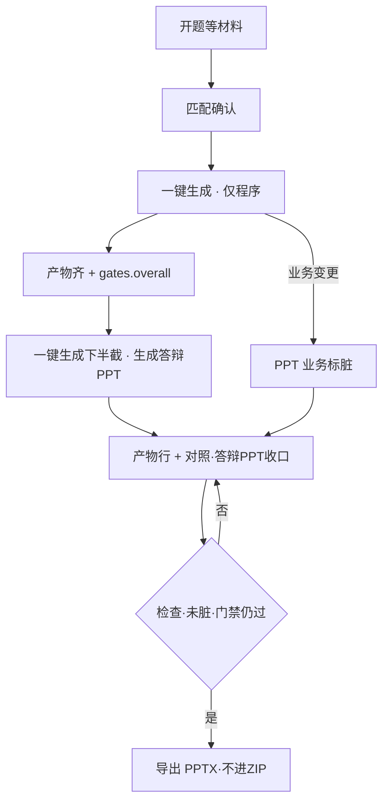

# 毕设答辩 PPT 生成模块（设计要点）

> **状态**：设计已收口；运营端前端已挂入（`frontend/src/ppt/*`，后端未齐时可用 mock 演示）；后端实现指导见 [`defense-ppt-backend.md`](./defense-ppt-backend.md)。正式 bake/PPT 任务尚未落地。**后端全部完成后须移除 mock**（见该文档 §1.4）。  
> **范围**：仅 **终期 / 毕业答辩 PPT**；不做开题答辩 PPT。  
> **对标参考**：[yuyuanweb/ai-ppt-generator](https://github.com/yuyuanweb/ai-ppt-generator)（借流水线与数据模型，不整仓搬技术栈）。  
> **关联**：交付主链路见 [`delivery-audit-rules.md`](./delivery-audit-rules.md)；场景轴 / 技术栈轴见 `.cursor/rules`；UI 原型见 [`../prototype/README.md`](../prototype/README.md)。

---

## 0. 一句话总纲

**材料 → 程序（bake 门禁通过）→ 答辩 PPT。**  
只做终期；业务字 ⊆ 开题∪实包；图嵌自产物；皮靠主题包种子；程序业务变则 PPT 业务必须跟；PPTX 不进 ZIP；子模块不喧宾夺主；对照不拆主 Tab。

---

## 1. 产品目标

1. 为学生毕设交付 **原生可编辑 `.pptx`**（非整页截图）。
2. 工厂 Web：**独立短任务生成 → 产物/对照收口手改 → 检查 → 导出**（手感接近一键生成程序，但是后置步骤）。
3. 与 bake / 开题 / 实包 **同源**：禁止编造未交付能力或技术名。
4. 同题寝室靠皮肤轴防撞；异题大纲与外观都拉开。
5. **不与程序同次生成**；证据不齐（缺模块图/E-R/运行态）不得开跑。

---

## 2. 主顺序与门闩

```
开题等材料 → 匹配确认 → 一键生成(仅程序，门禁通过)
                                              ↓
                                    生成答辩 PPT（独立任务）
                                              ↓
                              产物/对照收口 → 检查 → 导出 PPTX（不进 ZIP）
```

| 动作 | 条件 |
|------|------|
| **生成答辩 PPT** | 开题材料 ✓ · 工程已生成 ✓（模块图/E-R/用例可引用）· **程序就绪口径与 bake 可交付相同**（`gates.overall` 通过，即可下 ZIP 那一档；不另立探活标准） |
| **导出 / 下载 PPTX** | 生成条件仍成立 · PPT 检查无 error · **业务指纹未脏**（或已「按工程更新」）· **单独下载，不进学生 ZIP** |
| **换主题/版式族** | 随时可；**不**标与工程不一致；按项目种子从主题包挑选（同学生站 theme，**不做寝室批次互斥工作台**） |
| **ZIP 下载** | 现有门禁；与 PPTX **解耦** |

---

## 3. 三层模型

| 层 | 含义 | 同题寝室 | 异题 | 对标学生前端 |
|----|------|----------|------|--------------|
| **大纲结构** | 页序、页角色 | 必须同构 | 跟开题/域/能力 | 主流程，非皮肤 |
| **文案/图** | 要点、模块图、E-R… | 跟实包；可轻润色 | 跟题目 | Island / 产物图 |
| **版式外观** | 主题、变体、字体、母版壳 | 批次互斥拉开 | 更应拉开 | theme/chrome/layout/typeface |

内容 / 布局 / 主题分离；Web 预览与 PPTX **同一份 `deck.json`**。

### 3.1 业务真源（禁止瞎写）

优先级：

1. 开题 / 任务书原文  
2. bake 实包：菜单、模块、角色、主路径、表/E-R、技术栈扫描  
3. 产物图：模块图 SVG、E-R SVG、用例表等  

LLM **只整形**（裁剪、改写成要点）；不得发明模块/中间件/能力。手段对齐 `unit_flow`：上下文裁剪、结构化校验、`source_refs`、导出门禁、必要时 QA 同款反吹牛规则。

### 3.2 程序变更与同步

| 变更 | PPT |
|------|-----|
| 程序/实包 **业务**变了 | 业务指纹 **标脏**；须「按工程更新业务页」 |
| PPT **非业务**（主题/版式族/母版/装饰） | **不必**跟程序；更新业务页时 **保留皮** |
| 两边业务已不一致 | 提示不一致；**脏则禁止导出**（先对齐再下） |

**业务指纹建议计入（会标脏）：**

- 重 bake / 合卷导致工作区业务结果变化  
- 持久层 / Security 等实包技术轴变化  
- 菜单、features、模块树、用例表、E-R 结构或实体中文名变化  
- 开题/任务书正文变更（背景页跟材料）  

**不计入（不标脏）：**

- 学生站纯视觉软选项（theme/chrome/layout/typeface）  
- 仅 PPT 自己换皮  
- 仅改工厂日志、运行启停、与交付无关的运营备注  

### 3.3 「按工程更新」遇上人手改过的字（`locked`）

人手在对照里改过某条要点后，该块会打 **`locked`**（避免以后单页重生成冲掉）。

点「按工程更新业务页」时默认：

- **未锁定**的业务块：按当前开题∪实包重填，图引用刷新  
- **已锁定**的块：**跳过、保留人工字**  
- 结束后提示：「已更新 x 处；保留人工修改 y 处」；若锁定块与实包明显冲突，检查里给 **warning**（不自动覆盖）  

需要整页放弃人工改、强制跟工程时，另提供「本页丢弃人工修改并重填」（后置即可）。

---

## 4. 大纲口径（结构，非颜色）

### 4.1 学校实际（调研摘要）

- 「统一模板」多为母版壳（校徽、封面字段、字体页脚），不是全校锁死内容页序。  
- 同专业系统类叙事高度同构；文理与系统类大纲本就分叉。

### 4.2 工厂默认叙事（系统类终期）

```
封面 →（目录）→ 背景与需求 → 方案/技术选型
  → 系统设计（架构/模块/E-R）→ 实现与演示 → 测试 → 总结/致谢
```

- 学院母版：有则套壳；无则学术默认。  
- 大纲 **确定性题型模板拆 Unit**（不搞独立大纲确认大屏）；结构微调仅收口态、默认锁定。  
- **禁止**为防撞打散叙事骨架。  
- **不做**开题答辩 PPT。  
- **不做**工厂无法 bake 的纯无系统题目；**做**工厂已支持的全部业务域（全域）。

---

## 5. 版式与寝室防撞

| 轴 | 作用 |
|----|------|
| 主题包 | 色板、字体、少量 ambient |
| 页角色 layout | cover / toc / section / bullets / two-column / table / summary… |
| 同角色变体 | 防撞关键（如封面居中 / 色带 / 底栏） |
| 质感（可选） | 类比 chrome |

批次：`(theme × layout_family × typeface)` 互斥；种子可用 `project_id`。学院强制统一母版时以外观服从模板为准。

不做：flex 自由拖拽当主防撞。

---

## 6. 生成编排（技术取舍）

### 6.1 借

页级 TaskUnit、Semaphore 并发、`prepare→generate→check→repair`、证据裁剪、SSE、python-pptx、块 `locked`、导出 error/warning。

### 6.2 不整包搬

LangChain/LangGraph、ARQ/Redis、React 整仓编辑器、flex 求解器、AI bind_tools 改页、库存配图主路径、独立 PPT 账号体系。

### 6.3 子模块克制

- 不新开「答辩 PPT」主 Tab。  
- 不进一键生成同次流水线。  
- UI 不做 Canva 工作室；收口纠错向。

---

## 7. 信息架构（对照 **不拆** 主 Tab）

保持现网一个主 Tab：**产物 / 对照**。

| 区域 | PPT |
|------|-----|
| **一键生成** Tab 下半截 | **唯一开跑入口**（运行绿灯后解锁） |
| **产物** 文件行 | 状态、脏标、打开对照、检查、导出 PPTX（无「生成」） |
| **对照** 子 Tab「答辩 PPT」 | 同源预览、点改、换皮、按工程更新业务页 |

```
[ 匹配确认 ]  [ 一键生成 ]  [ 运行 ]  [ 日志 ]  [ 产物 / 对照 ]
                 程序；门禁过后下半截开跑PPT       上:产物行 下:对照含答辩PPT
```

对照是否升独立主 Tab：**不因 PPT 倒逼**；对照继续膨胀时另议。

---

## 8. ASCII 原型（不拆对照）

### 8.1 匹配确认（无 PPT）

```
┌─ 匹配确认 ─────────────────────────────────────┐
│ 骨架 / 领域 / 持久层 / 鉴权 …                    │
│ 确认 → 一键生成                                  │
│ ※ 无 PPT 选项                                    │
└─────────────────────────────────────────────────┘
```

### 8.2 一键生成 · 仅程序（PPT 未解锁）

```
┌─ 视觉与生成选项 ───────────────────────────────┐
│ 配色 / 质感 / 布局壳 / 字体 …（学生站）          │
│ □ 业务配置填充(LLM)                             │
│                        [ 一键生成 ]              │
└─────────────────────────────────────────────────┘

┌─ 下一步：答辩 PPT ───── 未解锁 ────────────────┐
│ 需：工程已生成 · 模块图/E-R 可用 · bake门禁通过  │
│ [生成答辩 PPT]  禁用                             │
└─────────────────────────────────────────────────┘
```

程序流水线：**无** PPT 步骤。

### 8.3 bake 门禁通过后 · 开跑解锁

```
┌─ 下一步：答辩 PPT ───── 可生成 ────────────────┐
│ 证据：开题✓  模块图✓  E-R✓  用例✓  门禁overall✓ │
│ 主题 [按种子▾]  版式族 [按种子▾]  母版 [无▾]  │
│ 小字：业务文案 ⊆ 开题∪实包；图嵌自产物         │
│                                                 │
│ 封面信息（全部必填 · 写入 cover 页）             │
│   学校 [________]* 学院 [________]*              │
│   班级 [________]* 姓名 [________]*              │
│   学号 [________]* 导师 [________]*              │
│   校徽 [粘贴区 · 可从 Word 复制]*               │
│   ※ 缺任一项：[生成答辩 PPT] 禁用               │
│                                                 │
│                        [ 生成答辩 PPT ]          │
└─────────────────────────────────────────────────┘
```

封面 **幻灯片本身始终生成**（大纲第一页固定 cover）；上述字段齐了才允许开跑，并全部写入该页。
### 8.4 生成中（独立短任务）

```
┌─ 正在生成答辩 PPT… ──────── 任务 #87 · 60% ───┐
│ ████████████░░░░  [取消] [日志]                  │
└─────────────────────────────────────────────────┘

┌─ 流水线（仅 PPT）──────────────────────────────┐
│ ✓ 收集证据（开题 + 菜单/栈 + 模块图/E-R/用例） │
│ … 填页 Unit（LLM 只整形，校验锁源）             │
│ · 瞎写/结构检查                                  │
│ · 写 deck.json（嵌入图引用）                     │
└─────────────────────────────────────────────────┘

┌─ Unit ─────────────────────────────────────────┐
│ ppt.cover     done                              │
│ ppt.modules   done   ← 嵌模块图                 │
│ ppt.er        generating ← 嵌 E-R               │
│ ppt.demo      queued                            │
└─────────────────────────────────────────────────┘
```

### 8.5 产物 / 对照（同一主 Tab）

```
┌─ 产物 ─────────────────────────────────────────┐
│ ZIP …                         [下载]             │
│ 工程目录 …                    [复制]             │
│ 填岛拆解计划                  [查看]             │
│                                                 │
│ 答辩 PPT  12页 · scholar · band                  │
│   状态：与工程一致 / ⚠ 业务可能不一致            │
│   [打开对照] [检查] [导出PPTX]                   │
│   ※ 无「生成」——开跑在「一键生成」下半截         │
└─────────────────────────────────────────────────┘

┌─ 对照视图 ─────────────────────────────────────┐
│ [数据库][模块][用例][接口][质量检查][交付复审][答辩PPT] │
│                                                 │
│ ┌─ 答辩 PPT ───────────────────────────────┐   │
│ │ [主题▾][版式族▾]  ← 非业务，换皮不标脏      │   │
│ │ [检查] [按工程更新业务页] [导出PPTX]        │   │
│ │ （脏标横幅文案待定）                         │   │
│ ├────┬────────────────────┬────────────────┤   │
│ │ 页 │ 16:9 预览/点改纠错  │ 证据 / 检查    │   │
│ │ …  │ 可嵌模块图·E-R      │                │   │
│ └────┴────────────────────┴────────────────┘   │
└─────────────────────────────────────────────────┘
```

### 8.6 脏标与检查导出

```
┌─ ⚠ 工程已更新，业务内容可能不一致（文案待定）──┐
│ 主题/版式可保留                                 │
│ [查看差异]  [按工程更新业务页]  [稍后]           │
└─────────────────────────────────────────────────┘

┌─ 答辩 PPT 检查 ────────────────────────────────┐
│ ✕ 未 bake 技术 / 模块不在实包 / 业务指纹脏      │
│ ⚠ 字数偏多…                                     │
│ 导出：无 error + bake门禁仍过 + 业务未脏         │
│ [回改]                         [导出 PPTX]       │
└─────────────────────────────────────────────────┘
```

### 8.7 流程简图



---

## 9. 图与演示页（界面截图要有，采集要可控）

系统类终期答辩 **一般都有界面截图**（登录、主流程关键屏）；缺图答辩会显得「没做出来」。  
工厂已有可靠矢量图（模块图、E-R）；界面图另走采集，**要有，但不赌无人值守乱截**。

| 图类 | 策略 |
|------|------|
| 模块图 / E-R | 生成时 **自动嵌入**产物 SVG |
| 用例/测试表 | 从产物表生成 |
| **界面截图** | **要**：演示相关页默认需要；采集见下 |
| 全自动爬页乱截 | **不做**（登录态/时机/错页不稳，难保证「正确」） |

### 9.1 界面截图怎么来（推荐）

在 **bake 门禁已过** 且预览可开的前提下，PPT 流水线增加一步 **「采集界面截图」**（可与填页并行或紧后）：

1. **半自动（默认）**：按主路径打开已知路由（登录、档案列表、申请、审核等，跟域主流程走），用演示账号登录后截关键屏；失败则该槽位标缺图。  
2. **对照里可重采 / 换图**：某张不对时，运营在运行预览停在目标页点「采当前页」替换，或上传本地图。  
3. **检查**：演示页缺必要截图 → **error（阻断导出）** 或至少 **强 warning**（落地默认：**缺主流程截图 = error**，与「答辩一般都有图」对齐）。

这样既承认「一般都有界面图」，又不把正确性寄托在完全黑盒自动截上。

### 9.2 仍可不截的

纯结构页（封面、目录、技术选型表、总结）不强制界面图。

### 9.3 演示账号与「真实数据」（学校口径）

部分学校会说答辩要用「真实数据」——在毕设语境里通常 **不是** 灌生产库/真实师生隐私，而是：

- **仿真业务数据**：姓名、院系、单据、时间线像真系统里会有的；列表不是空的、也不是 `test1` / `aaa` / `张三1` 一眼假  
- **可登录演示账号**：角色齐全（如读者+管理员），口令与 README 一致，现场能走通主路径  

工厂侧：

| 项 | 口径 |
|----|------|
| 数据从哪来 | **跟 bake 种子 / 填岛文案同源**；截图里看到的就是库里的演示数据 |
| PPT 里怎么写 | 演示账号页可写「角色 · 账号」（与 README 一致）；禁工厂黑话、禁「假数据/测试专用」话术 |
| 和 PPT 模块边界 | **逼真度主要靠程序种子质量**；PPT 负责采到有内容的屏，不另造一套「PPT 专用假库」 |
| 明确不做 | 导入学校真实学籍/客户隐私当种子 |

### 9.4 封面幻灯片与学生信息（全部必填）

- **封面页（cover）在大纲中固定存在**，不是可选项；每份答辩 PPT 必须有封面幻灯片。  
- 工作台按项目维护封面信息，**全部必填**后方可点「生成答辩 PPT」：

| 字段 | 必填 |
|------|------|
| 学校 | ✓ |
| 学院 | ✓ |
| 班级 | ✓ |
| 姓名 | ✓ |
| 学号 | ✓ |
| 指导教师 | ✓ |
| 校徽（图） | ✓ |

- 生成时上述字段 **一律写入** cover 页（无「是否写入」勾选）。  
- 缺任一项：开跑按钮禁用，并提示补全。  
- 对照里仍可改封面文案；改后属内容修订（校徽替换同理）。  
- 校徽与主题包正交：徽是封面素材，主题管配色版式。  
- 题目仍取自项目/开题题目，与身份字段一起上封面。

#### 9.4.1 校徽怎么来（粘贴为主）

实操里几乎没有单独发放的「校徽.png」；徽一般嵌在开题 / 任务书 / 学院 Word 里。

| 项 | 口径 |
|----|------|
| **主路径** | 在 Word 里选中校徽 → 复制 → 在工作台校徽槽 **粘贴** |
| **辅路径** | 选择本地图片（少见；粘贴失败时备用） |
| **必填含义** | 封面槽里 **已有校徽图**，不要求学生交独立 PNG 文件 |
| **明确不做** | 不依赖学校官网下矢量、不另建「校徽素材库」当硬前置 |

#### 9.4.2 透明底（写入封面前处理）

封面嵌徽最好透明底，但 **校徽常是「图形 + 校名文字」一体**，图里本身有白/浅色笔画；一刀切去白底容易扣残、留毛边。

| 项 | 口径 |
|----|------|
| **默认** | **粘贴原样入库**（先保证有图、能开跑） |
| **可选** | 槽旁提供「去掉白底」：对近白像素试透明；预览用棋盘格 |
| **可撤销** | 「恢复原图」一键回到刚粘贴的版本；不对就重贴更紧的框选 |
| **已有透明通道** | 「去掉白底」时仍以保留有效透明为主，不强行重抠 |
| **能力边界** | 只适合白底/浅灰底截图；徽+字、复杂底、徽内大块白 → **不保证扣干净**，以预览为准 |
| **运营习惯** | Word 里尽量只框徽（或框得紧一点）再复制，少带大片白页边 |

**界面短文案（建议）：**

> 从 Word 复制校徽后在此粘贴。默认保持原样；需要时再点「去掉白底」。徽和字在一起时可能去不干净，不对就恢复或重贴。

忌：「AI 抠图」「自动保证透明」「强制透明」。

---

## 10. 已拍板默认（按常见答辩 PPT + 你的答复；减少待确认）

| 项 | 默认 |
|----|------|
| 程序就绪 | **与 bake 可交付相同**（`gates.overall`） |
| PPTX 与 ZIP | **不进 ZIP**，产物单独导出 |
| 皮肤/寝室 | **项目种子挑主题包**即可；工作台不做寝室互斥 |
| 业务指纹 | 见 §3.2；学生站纯视觉不计入 |
| 按工程更新 vs 手改 | 见 §3.3：**跳过 locked，保留人工字** |
| 脏态导出 | **禁止**，先更新业务页 |
| deck 遇重 bake | **保留文件但标脏**，不默默当一致 |
| 页数 | 系统类约 **12～18 页**；模块多则合并要点，不一人一页无限加 |
| 封面 | **cover 页必有**；学校/学院/班级/姓名/学号/导师/校徽 **全部必填** 才允许生成。校徽 **Word 粘贴为主**；默认原样，**「去掉白底」可选可撤销**（徽+字可能扣不干净，以预览为准） |
| 演示账号 / 库内数据 | 见 §9.3：学校要的「真实」= **仿真业务数据**，不是生产隐私；PPT/截图跟种子同源 |
| 覆盖范围 | **工厂全部可 bake 域（全域 DOM-***）**；叙事用系统类终期模板（需求→设计→实现→测试）。工厂不出包的纯文科/无系统题不在范围 |
| 学院母版 | 有则盖壳；主题包仍可弱差异（色/变体在母版允许范围内） |
| 字体 | 导出优先用教室常见字体名（微软雅黑/宋体）；嵌入字体后置 |
| LLM 预算 | 与项目填岛 **共用**预算 |
| 部分页失败 | **保存已成功页**，失败 Unit 可重试 |
| 权限 | 与现网一致，**运营工作台**生成/导出 |
| 历史版本 | MVP **不保留多版本**；重新生成覆盖 deck（可先标脏） |
| 不一致文案 | 落地 UI 时再写短句；机制已定 |
| 界面截图 | **要有**；半自动按主路径采 + 对照可重采/换图；缺主流程图默认 **禁导出**；不做人爬虫式乱截 |

---

## 11. 仍只需你看一眼的（极少）

1. **不一致提示的最终中文文案**（机制已定，只差措辞）。  

---

## 12. 建议落地顺序

1. Deck schema + layout/主题包 + python-pptx；嵌模块图/E-R  
2. 门闩（= bake overall）+ 独立 PPT 任务 + 反瞎写 + 图嵌入  
3. **主路径半自动界面截图** + 对照重采/换图；缺图门禁  
4. 一键生成下半截开跑；产物行；对照子页手改/换皮  
5. 业务指纹脏标 + 按工程更新（尊重 locked）  
6. 学院母版、溢出检测  

---

## 13. 修订记录

| 日期 | 说明 |
|------|------|
| 2026-08-30 | 初稿：取经 ai-ppt、手改、版式防撞、学校模板；不做开题 PPT |
| 2026-08-30 | 收口：材料→程序→PPT；不拆对照；ASCII；同步脏标 |
| 2026-08-30 | 拍板：就绪=bake 门禁；PPTX 不进 ZIP；指纹/locked；主题包种子；压缩待确认 |
| 2026-08-30 | 界面截图：答辩要有；半自动主路径采集 + 可重采；缺图禁导 |
| 2026-08-30 | 「真实数据」= 仿真业务种子，非生产隐私；账号/截图跟 bake 同源 |
| 2026-08-30 | 澄清：PPT 覆盖工厂全域可 bake 域；「系统类」指叙事模板，不是只做部分 DOM |
| 2026-08-30 | 封面：工作台录入；cover 页必有；身份字段+校徽全部必填才生成 |
| 2026-08-30 | 运营端 `prototype/` 挂入答辩 PPT ASCII 对应交互原型（开跑/产物/对照/脏标） |
| 2026-08-31 | 校徽：Word 粘贴为主；默认原样，「去掉白底」可选可撤销（徽+字不保证扣干净） |
